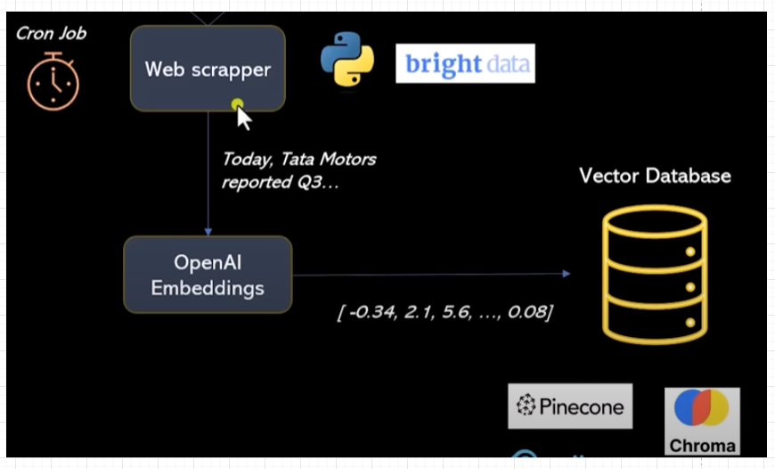

# langchain-rag-researchtool

conda create -p  venv  python=3.10 
conda activate venv/
pip install -r requirements.txt

streamlit run main.py

## Architecture

## Load content, Embedding and store in DB

## Do similarity search, get the chunks and create prompt and send to Open AI LLM

## Splits, Merged Splits and Overlap chunks

